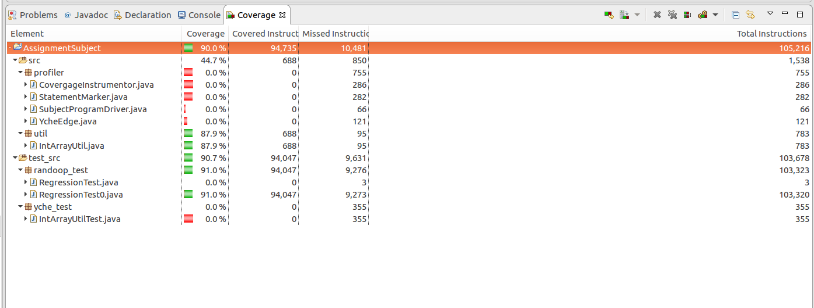
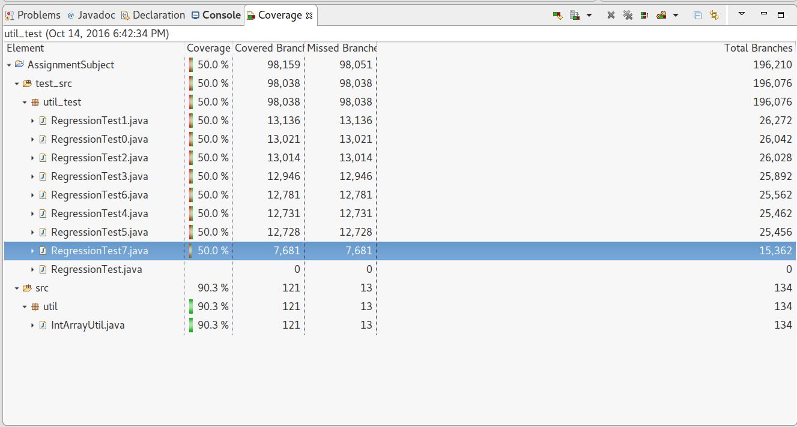

#Assignment 1
##Questions & Answers
###Q1: Randoop Related
- Q1-(1): **What is test oracle when conducting random testing via Randoop**

- Answer: five built-in **test oracle** are as follows:
  1. Equals to null: `o.equals(null)` should return `false`
  1. Reflexivity of equality: `o.equals(o)` should return `true`
  1. Symmetry of equality: `o1.equals(o2)` implies `o2.equals(o1)`
  1. Equals-hashcode: If `o1.equals(o2)==true`, then `o1.hashCode()==o2.hashCode()`
  1. No null pointer exceptions: NO `NullPointerException` is thrown if no null inputs are used in a test

---

- Q1-(2): **How do you use Randoop to generate test cases? (Please give a detailed descriptions on the steps and the parameter settings.)**

- Answer: as follows, in three steps

  - first, enter into Dir `UserfulShells`, and use the following shell script

  ```zsh
  RANDOOP_CLASSPATH="../Local-Jars/randoop-all-3.0.4.jar"
  SRC_CLASSPATH="../AssignmentSubject/bin"
  IO_ARGS="--classlist=my_classes.txt --junit-output-dir=../AssignmentSubject/test_src --junit-package-name=util_test"
  LITERAL_ARGS="--literals-file=literals.txt"
  TIME_LIMIT_ARGS=" --timelimit=600"
  java -cp $RANDOOP_CLASSPATH:$SRC_CLASSPATH randoop.main.Main gentests $IO_ARGS $LITERAL_ARGS $TIME_LIMIT_ARGS
  ```

  - second, run the shell

  ```zsh
  ./use_randoop_gen_tests.sh
  ```

  - third, list the gist of the output
  ```zsh
  Normal method executions:16443052
  Exceptional method executions:1472

  Average method execution time (normal termination):      0.0353
  Average method execution time (exceptional termination): 0.0957

  No error-revealing tests to output

  Regression test output:
  Regression test count: 3797
  Writing JUnit tests...
  ```

---

###Q2: Coverage Related
- Q2-(1): **Please specify the settings of Randoop**

- Answer: it is what is elaborated in Q1(2), the shell used is as follows:

```zsh
RANDOOP_CLASSPATH="../Local-Jars/randoop-all-3.0.4.jar"
SRC_CLASSPATH="../AssignmentSubject/bin"
IO_ARGS="--classlist=my_classes.txt --junit-output-dir=../AssignmentSubject/test_src --junit-package-name=util_test"
LITERAL_ARGS="--literals-file=literals.txt"
TIME_LIMIT_ARGS=" --timelimit=600"
java -cp $RANDOOP_CLASSPATH:$SRC_CLASSPATH randoop.main.Main gentests $IO_ARGS $LITERAL_ARGS $TIME_LIMIT_ARGS
```

---

- Q2-(2): **What are the statement coverage and branch coverage in your random testing**
- Answer: the statement coverage and branch coverage collected by EclEmma, underlying using Jacoco are as follows.

- Statement Coverage

Element | Coverage | Covered Instructions | Missed Instructions | Total Instructions
--- | --- | --- | --- | ---
AssignmentSubject | 90.6% | 1,513,492 | 156,559 | 1,670,051
IntArrayUtil.java | 96.7% | 757 | 26 | 783
RegressionTest0.java | 89.9% | 200,222 | 22,488 | 222,710
RegressionTest1.java | 90.3% | 201,877 | 21,798 | 223,675
RegressionTest2.java | 90.5% | 200,988 | 20,995 | 221,983
RegressionTest3.java | 90.7% | 200,287 | 20,484 | 220,771
RegressionTest4.java | 90.9% | 197,394 | 19,779 | 217,173
RegressionTest5.java | 90.9% | 196,637 | 19,623 | 216,260
RegressionTest6.java | 90.9% | 197,012 | 19,690 | 216,702
RegressionTest7.java | 91.0% | 118,318 | 11,673 | 129,991


- Branch Coverage

Element | Coverage | Covered Branch | Missed Branch | Total Branches
--- | --- | --- | --- | ---
AssignmentSubject | 50.0% | 98,159 | 98,051 | 196,210
IntArrayUtil.java | 96.7% | 121 | 13 | 134
RegressionTest0.java | 50.0% | 13,021 | 13,021 | 26,042
RegressionTest1.java | 50.0% | 13,136 | 13,136 | 26,272
RegressionTest2.java | 50.0% | 13,014 | 13,021 | 26,028
RegressionTest3.java | 50.0% | 12,946 | 12,946 | 25,892
RegressionTest4.java | 50.0% | 12,731 | 12,731 | 25,462
RegressionTest5.java | 50.0% | 12,728 | 12,728 | 25,456
RegressionTest6.java | 50.0% | 12,781 | 12,781 | 25,562
RegressionTest7.java | 50.0% | 7,681 | 7,681 | 15,362

- Screenshot:statement coverage and branch coverage





---

##Statement & Branch Coverage Measurement Program
###Understanding
- statement coverage, is the nodes covered in the control-flow-graph
- branch coverage, is the edges between nodes covered in the control-flow-graph

###Things to be implemented
- count nodes covered: a function to find whether a node is already covered, in the statement invokation phase and a function to insert
  - the underlying of which could be a hash_map, where the key is the statement id
- count edges covered: a function to judge whether a edge is already covered, by remembering the src node and current invoked dst node,
and a function to insert
  - the underlying of which could also be a hash_map, where the key is the pair of statement ids

###Part1:Statement Coverage

---

###Part2:Branch Coverage(Bonus)

---

##References
- [Tutorial](../../../SoftwareAnalysis/References/workshop1/Tutorial_1.pdf)
- [Assignment Requirements](https://course.cse.ust.hk/comp5111/assignment/assignment1.html)
- [Assignment Faq](http://sccpu2.cse.ust.hk/wurongxin/faq.html)
- [Soot Doc](https://course.cse.ust.hk/comp5111/assignment/soot_tutorials/index.html)
