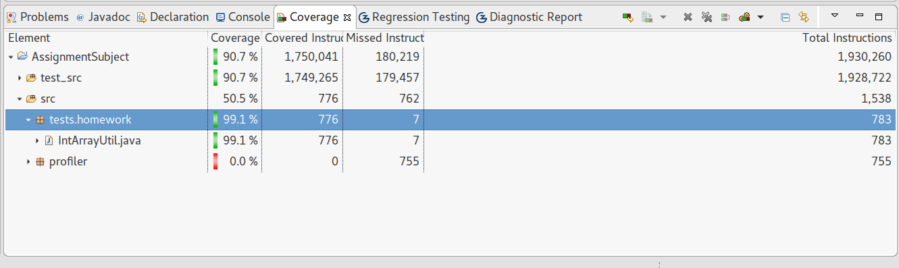
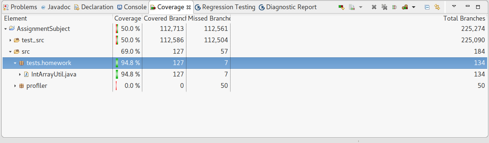

#Assign2

##Test Cases & Coverage
###Junit4 Test Cases

- Randoop, randoop files are held in [AssignCoverage/test_src/randoop](AssignCoverage/test_src/randoop)
- Janala, janala files are held in [AssignCoverage/test_src/janala](AssignCoverage/test_src/janala)

###Coverage
- Statement Coverage(15% Points)

Element | Coverage | Covered Instructions | Missed Instructions | Total Instructions
--- | --- | --- | --- | ---
IntArrayUtil.java | 99.1% | 776 | 7 | 783



- Branch Coverage(25% Points)

Element | Coverage | Covered Branch | Missed Branch | Total Branches
--- | --- | --- | --- | ---
IntArrayUtil.java | 94.8% | 127 | 7 | 134



##Test Drivers

Test drivers are put in [janala2_tmp/src/integration/java/tests/homework](janala2_tmp/src/integration/java/tests/homework). And there is a `ReadMe.md` in [janala2_tmp/ReadMe.md](janala2_tmp/ReadMe.md) to briefly introduce the work related to test drivers and Janala2 usage.

##Test Cases for Fault-Localization(40% Points)

Test cases are held in [AssignmentSubject/test_src/janala](AssignmentSubject/test_src/janala), where I mannally modify test cases generated from Janala, trying to achieve better distinctions between failures and okay executions.

###List of Potential Faulty Statements
- result is in [Scripts/gzoltar_faulty_statements.csv](Scripts/gzoltar_faulty_statements.csv)
- my own ranking report is in [Scripts/coefficient_rank](Scripts/coefficient_rank), with four coefficient mesurements
  - [Scripts/coefficient_rank/ample_coefficient.csv](Scripts/coefficient_rank/ample_coefficient.csv)
  - [Scripts/coefficient_rank/chiai_coefficient.csv](Scripts/coefficient_rank/chiai_coefficient.csv)
  - [Scripts/coefficient_rank/jacard_coefficient.csv](Scripts/coefficient_rank/jacard_coefficient.csv)
  - [Scripts/coefficient_rank/tarantula_coefficient.csv](Scripts/coefficient_rank/tarantula_coefficient.csv)

- result
  - the result of the second fault in line 304 is good, ranking the first
  - but the other is bad , beacase I did not generate good test cases for that I suppose

- observations
  - too many failure or too many suceess will influence the performance
  - and number of test cases between different categories should be quite similar to acheive better performance

##Fault Fixing(10% Points)

I found two faults.

- line 257 in [AssignmentSubject/src/tests/homework/IntArrayUtil.java](AssignmentSubject/src/tests/homework/IntArrayUtil.java)

  - faulty one

  ```java
  if(p == 0 || q == 0){
  ```

  - fixed one

  ```java
  if (p == 0 && q == 0) {
  ```

- line 304 in [AssignmentSubject/src/tests/homework/IntArrayUtil.java](AssignmentSubject/src/tests/homework/IntArrayUtil.java)

  - faulty one

  ```java
  if (diff >= min) {
  ```

  - fixed one

  ```java
  if (diff < min) {
  ```

And After fixing these two things, test cases [AssignFixFault/test_src](AssignFixFault/test_src) are all pass. And the source code
is in [AssignFixFault/src/tests/homework/IntArrayUtil.java](AssignFixFault/src/tests/homework/IntArrayUtil.java).


##Bonus(30% Points)
###Summary

I modify the soot profiler a little bit to record the line number, whose source code is held in [AssignmentSubject/src/profiler](AssignmentSubject/src/profiler). And I write a python script to do the fault localization.
The related implementation is in [Scripts/fault_localization.py](Scripts/fault_localization.py).

There is also a [Scripts/ReadMe.md](Scripts/ReadMe.md) to explain the files.

###Build Steps
- use eclipse helps me build the [AssignmentSubject](AssignmentSubject), with compiler level 1.7

- enter the `Scripts` folder to do next few things
```zsh
cd Scripts
```

- run the script in [Scripts/use_soot_driver.sh](Scripts/use_soot_driver.sh) to generate instrumented files put in [Scripts/sootOutput/tests/homework](Scripts/sootOutput/tests/homework), **with your environment java7 as the java environment**. This script will output three files.

```zsh
./use_soot_driver.sh
```

- run the script [Scripts/cp_related_class_files.sh](Scripts/cp_related_class_files.sh), to copy files build by eclipse ant

```zsh
./cp_related_class_files.sh
```

- shift to Java8 environment and then run the python script, which executes all junit test cases and puts them in [Scripts/test_case_res](Scripts/test_case_res) folder

```zsh
python exec_all_junit_test_cases.py
```

- then use the fault_localization tool(python script), the result of which is put in [Scripts/coefficient_rank](Scripts/coefficient_rank)

```
python fault_localization.py
```
