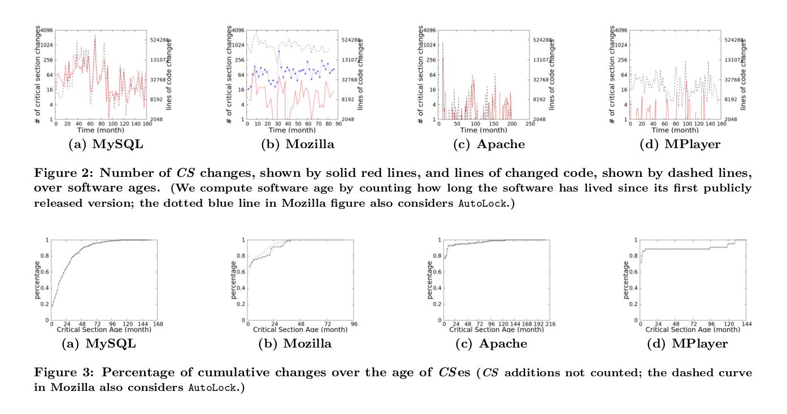

#Reading Material
##Title
- [What Change History Tells Us about Thread Synchronization](https://course.cse.ust.hk/comp5111/readings/fse15/proceedings/p426-gu.pdf)
  - ESEC-FSE, ACM SIGSOFT Symposium on the Foundation of Software Engineering/ European Software Engineering Conference

##Key problem
The key problem consists of two parts,  (1) how critical sections are changed to solve performance problems (i.e. over-synchronization issues) and (2) how software changes lead to synchronization-related correctness problems (i.e. concurrency bugs).

##Input
Four repositories consisting of  their commitments’ information, i.e, code revision history and source codes, namely  Mysql, Mozilla, Apache, MPlayer, all written in C/C++ and quickly evolving.

##Output
The relationship between lock, synchronization and code revisions.

##Contribution
First, the paper conducts experiments on four popular open source repositories on concurrency issues and gives suggestions about the relationship between lock, synchronization and code revisions. Second, the paper conducts many experiments to support that their methodology is feasible to use, in consideration of time and space.

##Research Pattern
In definition, the paper fits into Descriptive-Process pattern. In my view, the paper follows the experimental-results-oriented pattern, conducting case studies on popular repositories to show their contributions on methodology and analysis. And this paper follows the empirical-study pattern, it may not be possible to us to get the specific evaluation results from them, since the output of the paper is some recommendations.

##Summary
**Abstraction and Conclusion**    
Since multi-threading programs are quite pervasive and difficult to debug, the paper does case studies of four popular quickly evolving code repositories on lack and over synchronization of programs, where synchronization is used to tackle the program arising from the race conditions. The case studies mainly focus on how critical section codes are changed and the mechanism of concurrency bugs introduced from the changes.
Four representative repositories are discussed in the paper, namely Mysql, Mozilla, Apache, MPlayer, all written in C/C++ and quickly evolving . The authors in the paper argues and concludes that their findings provide insights and motivation for future re-search on tackling synchronization problems, both lack-of-synchronization and over-synchronization problems.
The paper’s organization flows as follows, introduction, methodology, critical section changes, over synchronization study, concurrency bug origins, related work and conclusion. In this report, these section are summarized in four parts namely introduction and related work, methodology, synchronization experiments and concurrency bug origins, which convey the most important contributions of the paper.

**Introduction-RelatedWork**    
*Introduction Part*    
They summarize three common things about real-world big projects. First, there is information that goes beyond bug reports. Second, there is information derives from code revisions. Third, there is information that hides within the whole revision history. And intuitively, it is rather hard to collect the above three information.
Thus, the authors study how lock-protected critical sections are changed when software evolves, for which they design a hierarchical taxonomy for all critical section changes, based on their structural patterns and purposes. Besides, they conduct case studies to better understand over-synchronization issues (i.e., unnecessary synchronization degrades execution performance) and concurrency bug issues(i.e., lack of or incorrect synchronization hurts execution correctness), the two parts over-synchronization and concurrency bug issues are well elaborated in the paper.

*Related Work Part*    
There are work on concurrency bugs finding and new synchronization primitives evaluation based study, the authors argue that the paper complements them by checking software code repositories, which reveals real-world code development information unavailable in bug databases.
Different from previous research, where specifically,  two findings are made: (1) the number of racy variables remains high over time; (2) variables may go in and out of being racy over the course of a project, they argue that the difference between their work and others lies in that their study collects different types of software change information and answers different types of questions, including over-synchronization issues and concurrency-bug origin issues, from previous work. Besides, they argue that their study benefits the developing of profiling tools and over-synchronization solving tools.

**Methodology**   
*Background*     
The methodology discussed here mainly corresponds to the general study about critical-section changes. The research objects are four representative C/C++ repositories, namely Apache HTTPD Web Server, Mozilla Browser Suite, MPlayer Media Player, MySQL Database Server.
Taxonomy of changes are introduced, e.g, add, removing, modification and purposes patterns are introduced namely, correctness, fixing functional bugs, functionality, adding or changing code functionality, maintainability, code refactoring, performance, improving performance, robustness, adding sanity checks.
Mechanisms
Accurate categorization requires control-flow and pointer-alias analysis, which unfortunately cannot scale to large code repositories, so they choose to use regular-expression based Python scripts, as it offers us the best balance between complexity and accuracy. Besides, alternative approaches like AST-based analysis offers little accuracy increase. Given the complexity constraints, they only consider critical sections that start and end in the same function.
Due to space constraints, some analysis details, such as more detailed categorization and comments handling, are skipped. Due to the huge amount of code under study, they intentionally trade off some analysis accuracy for analysis speed and hence could miss some critical section changes. They use the identity of lock-acquisition function to uniquely identify each critical section.

*Effectiveness*        
At the end, they argue that their methodology yields good result with two reasons.
First, their manual checking of 500 randomly sampled script results shows that their script has lower than 5% false positive rate, which is quite good supported by this experimental result.
Second, the inaccuracy does not affect the main observations and implications of their study. For example, since they focus on synchronization challenges, the inaccuracy in counting critical section body changes (e.g., not considering callee changes or not considering body changes in AutoLock critical sections) does not affect their main observations.

*Critical-Sections Changes*     
The paper shows that good tools are needed to help (1) judge whether there is a need for adding(for both newly written code and already existing code) or removing lock synchronization; (2) adjust synchronization details for performance and correctness concerns, which applies to both lock synchronization (i.e., adjusting critical section boundaries and variables) and condition-variable synchronization (i.e., adjusting signals and waits); (3) tackling over-synchronization issues; and others.

##Expriments
###Synchronization Experiments     
**Concept**  
Over-synchronization happens when unnecessary synchronization is added to the software. It would overly constrain software interleaving and lead to performance degradation. Over-synchronization is a real problem, and is cared by developers. Developers change synchronization primitives to enable lock-contention profiling in MySQL and Mozilla, and sometimes relieve over synchronization at the cost of code readability or functionality.

**Discussion**    
Their study demonstrates that discovering and fixing over-synchronization take a lot of manual effort and are error prone. (1) All three types of changes/fixes discussed can potentially introduce concurrency bugs and demand non-trivial synchronization correctness reasoning. (2) Many new lock variables are introduced during these fixes. The ad-hoc way of introducing these variables can easily lead to correctness and/or maintenance problems. (3) The code movement during these fixes.

###Concurrency Bug Origins Experiments     
**Concept**     
Facing large real-world multi-threaded software, it is critical to improve the performance and accuracy of existing concurrency-bug analysis techniques.

**Discussion**   
First, synchronization analysis can be significantly simplified for many bugs through history awareness. With old synchronization-context information, about half of the studied bugs would require no new synchronization analysis to be detected, because their buggy code is inside completely old synchronization contexts.
Second, memory-access analysis can be significantly simplified for many bugs through history awareness. About half of the studied bugs only involve new variables accessed by new instructions with pointers propagated through new instructions. Therefore, detecting them only requires memory-access analysis for the changed code, instead of the whole Program.
Third, about a quarter of the studied bugs can benefit from both almost-no synchronization analysis and revision-local memory-access analysis discussed, and hence would require extremely simple analysis to discover.

##Evaluation
- 
- 

##Reflection
There is a lack of good profiling tools available, it is a good opportunity for us to develop such one, which incorporate some randomized algorithms to fast sample the changes and compute the possibility to incur bugs. Such a platform is a good tool, and some theoretical metrics could derive from similar papers like the reported one here.

##Appendix, Preliminaries
**Brief Introduction**   
Several basic concepts about the parallel programming are briefly introduced to provide a background of parallel program testing. First, the two major concepts parallel and concurrency are introduced, there are different actually. Second, the concurrent program discussed in this report is built for the shared memory setting, e.g, multicore machines with ram as the shared memory for the communication between different threads. Third, the synchronization is introduced, which is the major topic of the paper reported in this report.

**Parallel vs Concurrency**   
The parallel lies in the setting where you have multicore machine, GPU, or other co-processors that gives the ability to run the instructions in parallel, no matter the task-level parallel or data-level parallel.
However, concurrency does not mean that the have some many cores to help you conducting computations, there is a typical setting, where you are stuck with network communication or disk input output, then you can release the occupation of computing cores. Here the scheduling policy gives you concurrency.

**Shared-Memory**   
In modern processors, there are multiple cores there, which gives us the ability to bind threads, the logical concepts of computing components to. They may load different instructions, but sometimes, they need to acquire others processing status. This could be done with the shared ram memory.
Critical-Section
Critical sections are the pieces of instructions issued by multiple threads that wants to acquire the limited number of resources, just as many boys and girls, e.g, 10 wants to compete for 5 seats. To deal with the race condition, in critical section, threads need to use lock or other synchronization techniques to solve the problem.

**Synchronization**   
The instructions executed on each core may have some dependencies on the data stored in shared memory, e.g, thread 0 wants to get the intermediate result of thread 1 which is stored on the shared ram memory, then thread 0 should be idle, and scheduled out and notified after the data is ready. This could simply be done with the pthread library or win32 thread library with interfaces of  mutex and spin lock, condition variable, semaphore, etc. If you are interested in these technologies, please google them.

##Related Links
###Citation
- [Gu R, Jin G, Song L, et al. What change history tells us about thread synchronization[C]//Proceedings of the 2015 10th Joint Meeting on Foundations of Software Engineering. ACM, 2015: 426-438.](http://dl.acm.org/citation.cfm?id=2786815)

###Abstract
> Multi-threaded programs are pervasive, yet difficult to write.
Missing proper synchronization leads to correctness bugs
and over synchronization leads to performance problems.
To improve the correctness and efficiency of multi-threaded
software, we need a better understanding of synchronization
challenges faced by real-world developers.
This paper studies the code repositories of open-source
multi-threaded software projects to obtain a broad and indepth
view of how developers handle synchronizations.
We first examine how critical sections are changed when
software evolves by checking over 250,000 revisions of four
representative open-source software projects. The findings
help us answer questions like how often synchronization is an
afterthought for developers; whether it is difficult for developers
to decide critical section boundaries and lock variables;
and what are real-world over-synchronization problems.
We then conduct case studies to better understand (1)
how critical sections are changed to solve performance problems
(i.e. over-synchronization issues) and (2) how software
changes lead to synchronization-related correctness
problems (i.e. concurrency bugs). This in-depth study
shows that tool support is needed to help developers tackle
over-synchronization problems; it also shows that concurrency
bug avoidance, detection, and testing can be improved
through better awareness of code revision history

###Author-Github-Repo
- [ConAnalysis](https://github.com/ruigulala/ConAnalysis)
- [concurrency-exploits](https://github.com/ruigulala/concurrency-exploits)

###Study-Open-Source-Projects
- [Apache Httpd Web Server](https://github.com/apache/httpd)
- [Mozilla Browser Suite](https://github.com/mozilla/gecko-dev)
- [MPlayer media player](https://github.com/mpv-player/mpv)
- [MySQL Database Server](https://github.com/MariaDB/server)
